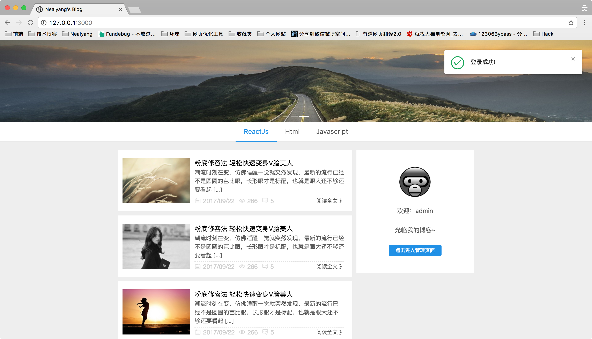

# 实战react技术栈+express前后端博客项目（5）-- 前后端实现登录功能

***[项目地址：](https://github.com/Nealyang/React-Express-Blog-Demo)https://github.com/Nealyang/React-Express-Blog-Demo***

> 本想等项目做完再连载一波系列博客，随着开发的进行，也是的确遇到了不少坑，请教了不少人。遂想，何不一边记录踩坑，一边分享收获呢。分享当然是好的，
如果能做到集思广益，那岂不是更美。我们的口号是：***坚决不会烂尾***

***本博客为连载代码博客同步更新博客，随着项目往后开发可能会遇到前面写的不合适的地方会再回头修改。如有不妥~欢迎兄弟们不啬赐教。谢谢！***

## 登录部分

- 登录截图

## 前端部分实现

接上篇，我们登录界面已经画完了，登录功能，涉及到异步请求。所以大致我需要需要如下几个action。请求发起action，请求结束action，错误信息提醒action，登录action，注册action以及后面免登陆我们用到的自动登录action。

因为该登录功能涉及到的都是全局的信息，所以这里我们放到index的reducer中处理

    const initialState = {
        isFetching: true,
        msg: {
            type: 1,//0失败 1成功
            content: ''
        },
        userInfo: {}
    };
    
    export const actionsTypes = {
        FETCH_START: "FETCH_START",
        FETCH_END: "FETCH_END",
        USER_LOGIN: "USER_LOGIN",
        USER_REGISTER: "USER_REGISTER",
        RESPONSE_USER_INFO: "RESPONSE_USER_INFO",
        SET_MESSAGE: "SET_MESSAGE",
        USER_AUTH:"USER_AUTH"
    };
    
    export const actions = {
        get_login: function (username, password) {
            return {
                type: actionsTypes.USER_LOGIN,
                username,
                password
            }
        },
        get_register: function (data) {
            return {
                type: actionsTypes.USER_REGISTER,
                data
            }
        },
        clear_msg: function () {
            return {
                type: actionsTypes.SET_MESSAGE,
                msgType: 1,
                msgContent: ''
            }
        },
        user_auth:function () {
            return{
                type:actionsTypes.USER_AUTH
            }
        }
    };
    
    export function reducer(state = initialState, action) {
        switch (action.type) {
            case actionsTypes.FETCH_START:
                return {
                    ...state, isFetching: true
                };
            case actionsTypes.FETCH_END:
                return {
                    ...state, isFetching: false
                };
            case actionsTypes.SET_MESSAGE:
                return {
                    ...state,
                    isFetching: false,
                    msg: {
                        type: action.msgType,
                        content: action.msgContent
                    }
                };
            case actionsTypes.RESPONSE_USER_INFO:
                return {
                    ...state, userInfo: action.data
                };
            default:
                return state
        }
    }
    
### 前端登录和注册action发起

    class LoginFormCom extends Component {
        constructor(props) {
            super(props);
        }
    
        handleLogin = (e) => {
            e.preventDefault();
            this.props.form.validateFields((err, values) => {
                if (!err) {
                    this.props.login(values.userName,values.password)
                }
            });
        };
    
        render() {
            const {getFieldDecorator} = this.props.form;
            return (
                <Form onSubmit={this.handleLogin} className={style.formStyle}>
                    <FormItem>
                        {getFieldDecorator('userName', {
                            rules: [{required: true, message: '请输入用户名!'}],
                        })(
                            <Input prefix={<Icon type="user" style={{fontSize: 13}}/>} placeholder="Username"/>
                        )}
                    </FormItem>
                    <FormItem>
                        {getFieldDecorator('password', {
                            rules: [{required: true, message: '请输入密码!'}],
                        })(
                            <Input prefix={<Icon type="lock" style={{fontSize: 13}}/>} type="password"
                                   placeholder="Password"/>
                        )}
                    </FormItem>
                    <FormItem>
                        <Button className={style.loginButton} type="primary" htmlType="submit">
                            登录
                        </Button>
                    </FormItem>
                </Form>
            )
        }
    }
    
    const LoginForm = Form.create()(LoginFormCom);
    
    export default LoginForm
    
 如上代码，在handleLogin中，我们调用父组件传进来的login方法。可能得说是爷爷组件吧。罢了，就是其容器组件。
 
 而容器组件Home.js中的代码如下：
 
     Home.defaultProps = {
         userInfo:{}
     };
     
     Home.propsTypes = {
         userInfo:PropTypes.object.isRequired
     };
     
     function mapStateToProps(state) {
         return{
             userInfo:state.globalState.userInfo
         }
     }
     
     function mapDispatchToProps(dispatch) {
         return{
             login:bindActionCreators(actions.get_login,dispatch),
             register:bindActionCreators(actions.get_register,dispatch)
         }
     }
     
     export default connect(
         mapStateToProps,
         mapDispatchToProps
     )(Home);
     
 如上，我们已经定义了login和register。分别为登录和注册两个方法。在登录部分我们如上写。当然，注册功能也是如上。
 
 ### 登录、注册saga的处理
 
 因为登录和注册都是异步的，所以这里我们需要saga去监听这个action的发起。然后对应的去处理。

    
    export function* register (data) {
        yield put({type:IndexActionTypes.FETCH_START});
        try {
            return yield call(post, '/user/register', data)
        } catch (error) {
            yield put({type:IndexActionTypes.SET_MESSAGE,msgContent:'注册失败',msgType:0});
        } finally {
            yield put({type: IndexActionTypes.FETCH_END});
        }
    }
    
    
    export function* registerFlow () {
        while(true){
            let request = yield take(IndexActionTypes.USER_REGISTER);
            let response = yield call(register, request.data);
            if(response&&response.code === 0){
                yield put({type:IndexActionTypes.SET_MESSAGE,msgContent:'注册成功!',msgType:1});
                yield put({type:IndexActionTypes.RESPONSE_USER_INFO,data:response.data})
            }
    
        }
    }

这里我们就举例说下registerFlow吧，其实也就是监听USER_REGISTER的action。然后调用register方法，发送请求开始action（界面出现Loading），然后请求结束action。接收到请求后，拿出数据，发送拿到数据后的action

基本思路如上，代码如上，大家研究研究哈，不明白的地方，直接issue。

## 后段部分

    router.post('/register', (req, res) => {
        let {userName, password, passwordRe} = req.body;
        if (!userName) {
            responseClient(res, 400, 2, '用户名不可为空');
            return;
        }
        if (!password) {
            responseClient(res, 400, 2, '密码不可为空');
            return;
        }
        if (password !== passwordRe) {
            responseClient(res, 400, 2, '两次密码不一致');
            return;
        }
        //验证用户是否已经在数据库中
        User.findOne({username: userName})
            .then(data => {
                if (data) {
                    responseClient(res, 200, 1, '用户名已存在');
                    return;
                }
                //保存到数据库
                let user = new User({
                    username: userName,
                    password: md5(password + MD5_SUFFIX),
                    type: 'user'
                });
                user.save()
                    .then(function () {
                        User.findOne({username: userName})
                            .then(userInfo=>{
                                let data = {};
                                data.username = userInfo.username;
                                data.userType = userInfo.type;
                                data.userId = userInfo._id;
                                responseClient(res, 200, 0, '注册成功', data);
                                return;
                            });
                    })
            }).catch(err => {
            responseClient(res);
            return;
        });
    });
    
 后端这边其实都差不多，我们拿注册举例子。简单解释下上面代码
 
 responseClient是封装的一个方法。代码如下：
 
     module.exports = {
         MD5_SUFFIX: 'eiowafnajkdlfjsdkfj大姐夫文姐到了困难额我积分那看到你@#￥%……&）（*&……）',
         md5: function (pwd) {
             let md5 = crypto.createHash('md5');
             return md5.update(pwd).digest('hex')
         },
         responseClient(res,httpCode = 500, code = 3,message='服务端异常',data={}) {
             let responseData = {};
             responseData.code = code;
             responseData.message = message;
             responseData.data = data;
             res.status(httpCode).json(responseData)
         }
     }
     
 让你简写很多代码。然后判断用户名、密码是否为空以及两次密码是否一致。（虽然这些部分在前端也应该做判断，但是后端也尽量保障一下）。
 
 验证用户是否已经在数据库中。如果不存在，则存储下，然后将用户信息返回。如果存在，则返回给客户端相应的信息。
 
 注意这里我们因为用的saga，所以只要是http请求三次握手成功的，我们都是返回200.对于用户名重复、别的错误，我们统一在返回的数据中给个状态码标识。
 
 存储的时候我们用md5加密，为了防止md5解密，我们在后面添加了一个随机的字符串。在登录的时候，拿到用户的登录密码，然后加上随机字符串，进行md5加密再与数据库数据记性比较也就OK了。
 
 后端实现基本思路就是这些，然后对于mongoose的基本操作这里就不赘述，大家可自行查看文档。
 
     router.post('/login', (req, res) => {
         let {username, password} = req.body;
         if (!username) {
             responseClient(res, 400, 2, '用户名不可为空');
             return;
         }
         if (!password) {
             responseClient(res, 400, 2, '密码不可为空');
             return;
         }
         User.findOne({
             username,
             password: md5(password + MD5_SUFFIX)
         }).then(userInfo => {
             if (userInfo) {
                 //登录成功
                 let data = {};
                 data.username = userInfo.username;
                 data.userType = userInfo.type;
                 data.userId = userInfo._id;
                 //登录成功后设置session
                 req.session.userInfo = data;
     
                 responseClient(res, 200, 0, '登录成功', data);
                 return;
             }
             responseClient(res, 400, 1, '用户名密码错误');
     
         }).catch(err => {
             responseClient(res);
         })
     });
     
 ## 总结
 
 基本到这，就是实现了一个查和增的过程。也实现了前后端的基本交互。大家感受下哈~
 
 然后大家肯定也是发现了，登录了以后，貌似每次刷新我们都要再重新登录，这并不是我们想要的。当然，这部分功能，我们将在下一篇博客中介绍。
 
 ## 项目实现步骤系列博客
 
 - [x] [实战react技术栈+express前后端博客项目（0）-- 预热一波](./00_预热一波.md)
 - [x] [实战react技术栈+express前后端博客项目（1）-- 整体项目结构搭建、state状态树设计](./01_整体项目结构搭建、state状态树设计.md)
 - [x] [实战react技术栈+express前后端博客项目（2）-- 前端react-xxx、路由配置](./02_前端react-xxx、路由配置.md)
 - [x] [实战react技术栈+express前后端博客项目（3）-- 后端路由、代理以及静态资源托管等其他配置说明](./03_后端路由、代理以及静态资源托管等其他配置说明.md)
 - [x] [实战react技术栈+express前后端博客项目（4）-- 博客首页代码编写以及redux-saga组织](./04_博客首页代码编写以及redux-saga组织.md)
 - [x] [实战react技术栈+express前后端博客项目（5）-- 前后端实现登录功能](./05_前后端实现登录功能.md)
 - [ ] 实战react技术栈+express前后端博客项目（6）-- 使用session实现免登陆+管理后台权限验证
 - [ ] 实战react技术栈+express前后端博客项目（7）-- 前端管理界面用户查看功能+后端对应接口开发
 - [ ] 实战react技术栈+express前后端博客项目（8）-- 前端管理界面标签管理功能+后端对应接口开发
 - [ ] 实战react技术栈+express前后端博客项目（9）-- 前端管理界面评论管理功能+后端对应接口开发
 - [ ] 实战react技术栈+express前后端博客项目（10）-- 前端管理界面发表文章功能
 - [ ] 实战react技术栈+express前后端博客项目（11）-- 后端接口对应文章部分的增删改查
 - [ ] 实战react技术栈+express前后端博客项目（12）-- 前端对于发文部分的完善（增删改查、分页等）
 - [ ] 实战react技术栈+express前后端博客项目（13）-- 前端对于发文部分的完善（增删改查等）
 - [ ] 实战react技术栈+express前后端博客项目（14）-- 内容详情页以及阅读数的展示
 - [ ] 实战react技术栈+express前后端博客项目（15）-- 博客添加评论功能以及对应后端实现
 - [ ] 实战react技术栈+express前后端博客项目（16）-- pm2 的使用说明
 - [ ] 实战react技术栈+express前后端博客项目（17）-- 收工
 
 ## 交流
 
 倘若有哪里说的不是很明白，或者有什么需要与我交流，欢迎各位提issue。或者加群联系我~
 
 ***扫码关注我的个人微信公众号，直接回复，必有回应。分享更多原创文章。点击交流学习加我微信、qq群。一起学习，一起进步***
 
 
 
 ---
 
 欢迎兄弟们加入：
 
 Node.js技术交流群：209530601 
 
 React技术栈：398240621
 
 前端技术杂谈：604953717 (新建)
 
 ---
 
 